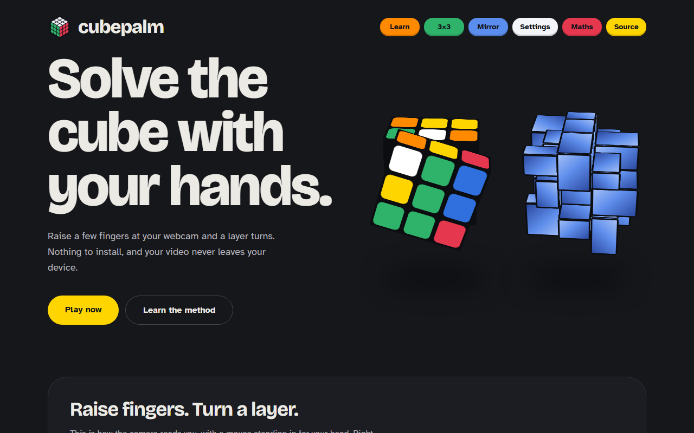
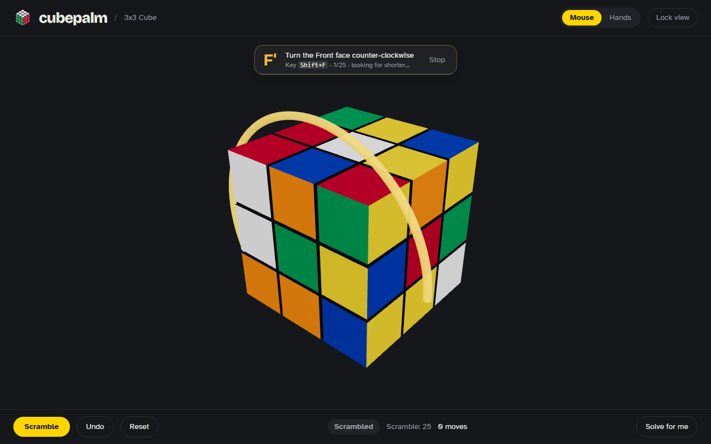
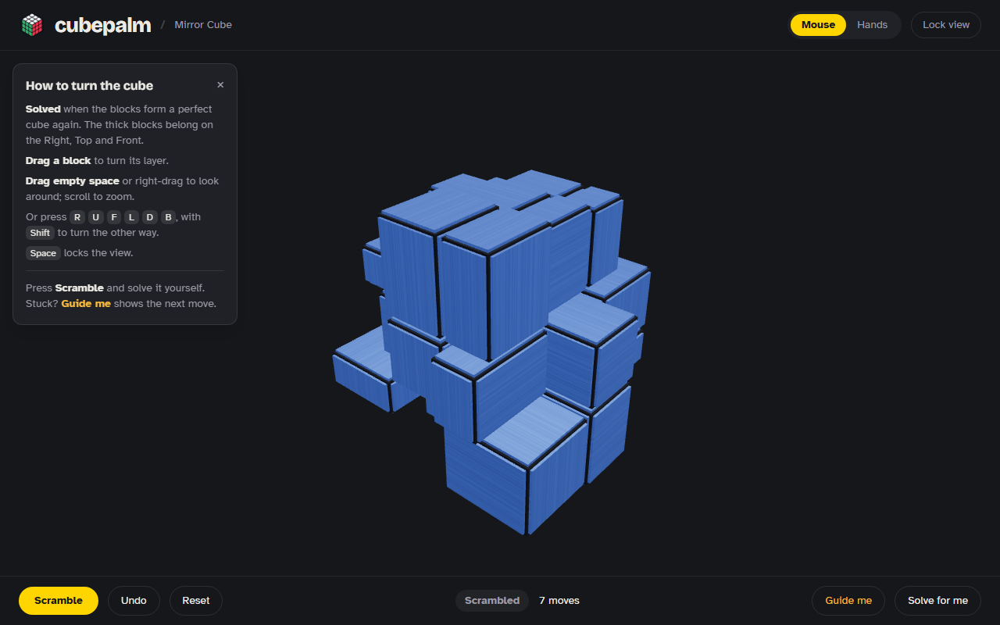
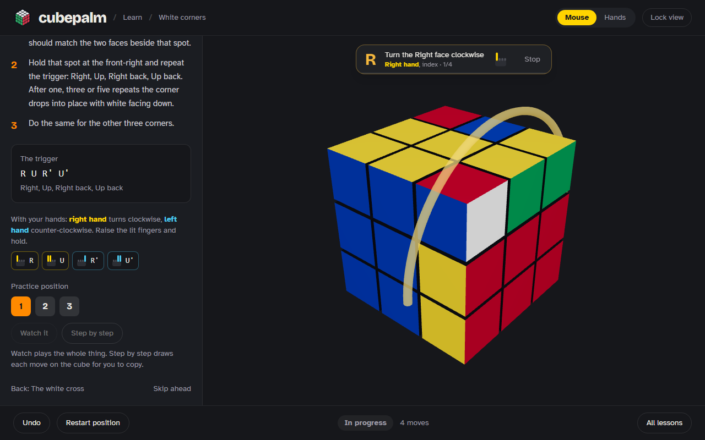

<div align="center">


# CubePalm

**Solve a Rubik's Cube with your hands.**

Raise a few fingers at your webcam and a layer of the cube turns.
Everything runs in your browser, so your camera feed never leaves your device.

[**Live demo**](https://cube-smoky-iota.vercel.app) &nbsp;·&nbsp; [How it works](#how-it-works) &nbsp;·&nbsp; [Run it locally](#run-it-locally)




</div>

## Why "CubePalm"

A cube you hold in the palm of your hand, without holding anything: your open hand, in front of a webcam, is the controller.

## What is new here

Hand-controlled cube demos usually do one thing: a pinch or a swipe turns a face, on a single 3×3, with a solver library bolted on. CubePalm goes further.

| | A typical hand-tracking cube | **CubePalm** |
|---|---|---|
| **Moves by hand** | A few moves, or grab-and-twist | **Every layer turn, including slices**, from a small finger-sign alphabet. The *fingers* pick the layer and the *hand* picks the direction |
| **Two hands** | One hand does everything | Right hand turns clockwise, left hand turns back, each with its own colour, so you never think about direction |
| **Solving help** | Press solve, watch it play | **You solve it yourself by default.** Ask for a guide and an arrow on the cube shows the next move, in finger signs too |
| **The solver** | Takes the first answer a library finds | **Written from scratch.** It searches six angles at once for a shorter route, keeps refining while you play, and **proves the route is the shortest possible** once the cube is close enough |
| **Scrambles** | A random string of moves | A **uniformly random cube state** from the browser's secure random generator, solved and played backwards, never repeating a recent one |
| **Puzzles** | One cube | A 3×3 and a **silver Mirror Cube** whose solved state is a *shape*, not a colour |
| **Learning** | None | An **Academy** that teaches the layer-by-layer method with live goals, a demo of every position and the finger signs for each move |
| **Privacy** | Often needs a server | **No backend.** Hand tracking, solving and 3D all run on your device |
| **Trust** | Hard to tell if it's right | Every solution and lesson is checked against a **second, independent cube engine** |

## What you can do

<table>
<tr>
<td width="50%"><br /><b>Try a sign without a webcam.</b> Raise fingers, hold, and a real layer turns. The left hand is blue and the right hand is yellow everywhere in the app.</td>
<td width="50%"><br /><b>Guide me.</b> An arrow shows the next move on the cube, with the key and the finger sign beside it. You stay looking at the cube, not a list of moves.</td>
</tr>
<tr>
<td width="50%"><br /><b>The Mirror Cube.</b> One colour, uneven blocks. It is solved when the blocks make a clean cube again.</td>
<td width="50%"><br /><b>The Academy.</b> Eight short lessons, each with a goal that fills as you go, practice positions, a demo, and the fingers to use.</td>
</tr>
</table>

### The signs

Four fingers, read as on or off. Counting from the index finger picks **R, U, F**; counting from the little finger picks **L, D, B**.

| Sign | Fingers up | Turns | | Sign | Fingers up | Turns |
|---|---|---|---|---|---|---|
| R | index | Right | | L | little | Left |
| U | index, middle | Top | | D | ring, little | Bottom |
| F | index, middle, ring | Front | | B | middle, ring, little | Back |
| M | index, little | Middle slice | | E | middle, ring | Equator slice |
| S | index, middle, little | Standing slice | | | | |

An open hand moving orbits the camera, two open hands spreading zoom it, and a closed fist held still locks the view.

## How it works

*In plain words. The long version is in [`docs/MATH.md`](docs/MATH.md).*

- **Reading your hands.** MediaPipe finds 21 points on each hand. CubePalm checks which fingertips are above their knuckles, takes a quick vote over a few frames so a flicker never counts, and turns a steady sign into a move.
- **Keeping track of a cube.** A cube is a list of where each piece is and how it is twisted. Every move is just a rearrangement of that list, so undo, scramble and "is it solved?" are all simple.
- **Finding a short solution.** The solver splits the problem in two: first get the cube into a much simpler family of positions, then finish from there. It tries many ways of doing both, from six angles side by side, and keeps the cheapest, counting steps the way a person makes them. A random scramble comes out at about 24 steps; no position ever needs more than 26.
- **Proving it is the shortest.** A second search works through every cheaper possibility in order. If it finds one, that is the shortest route there is; if it rules them all out, the route in hand is proven shortest. That takes a blink near the end of a solve and would take hours on a fully scrambled cube, so the guide says "shortest possible" only when it has the proof.
- **Scrambling fairly.** Every scramble is one of the 43 quintillion possible cubes, picked with equal chance, the same way competition scramblers work.
- **The Mirror Cube.** Each block remembers where it is and which way it is rotated, so the shape of the whole cube *is* the puzzle state.
- **Teaching.** Each lesson is a question asked of the cube ("are all four white edges in place?"), checked live to fill the progress bar.

## What it needs, and what happens when it doesn't get it

| | Needs | If it is missing |
|---|---|---|
| **The cube** | WebGL, which every current Chrome, Edge, Firefox and Safari has | A message says how to turn hardware acceleration on. If the browser takes the graphics context away mid-session, the cube is rebuilt when it comes back |
| **Hands** | A webcam, and HTTPS or localhost (browsers only hand out the camera there) | A plain message says whether the camera is blocked, missing or busy. Mouse and keyboard keep working |
| **Hand tracking** | A graphics card helps | Falls back to the processor: slower, still works |
| **The solver** | A background worker | If the worker fails to load, crashes or goes quiet, the solver moves to the main thread and carries on. If even that fails, the page says so and offers a retry; the cube stays playable |
| **Offline** | One visit while online | The app, fonts and solver are cached. Hand tracking is cached the first time Hands is used |

On a phone the cube draws at a lower pixel ratio and the background search uses fewer workers, and that search pauses whenever the tab is hidden. Every push runs the type check, lint, unit tests and browser tests in GitHub Actions.

## Run it locally

```bash
npm install      # also copies MediaPipe's runtime into public/
npm run dev      # http://localhost:5173
```

Hand control needs a webcam and `localhost` or https.

```bash
npm test                 # unit tests
npx playwright test      # end-to-end tests
npm run build            # type-check and production build
```

## Project layout

```
src/
  components/    screens (Home, play, Academy, Settings), the 3D cube, the CSS cube, signs, player
  core/
    puzzles/     the 3×3 and Mirror Cube behind one small interface
    solvers/     the two-phase solver and the step-by-step guide
    gestures/    landmarks to signs, view lock, camera orbit, keyboard and mouse
    academy/     lessons, and the checks that decide a stage is done
  state/         small stores: puzzle, settings, Academy progress
tests/e2e/       Playwright specs
docs/            how it works (the maths), screenshots
```

## Deploy

A static site with no backend. Import the repository into Vercel and deploy; `vercel.json` has the build settings.

## Built with

React 19 · TypeScript · Vite · Tailwind CSS v4 · three.js (react-three-fiber) · MediaPipe Tasks Vision · cubing.js · zustand · Vitest · Playwright

<div align="center">

Made by [Jay Guri](https://github.com/JayGuri)

</div>
